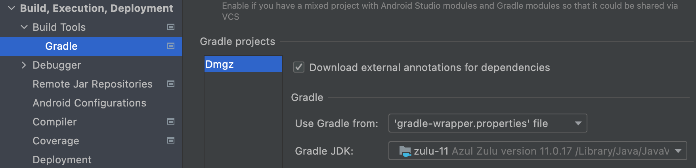

# Java Setup

## Download JDK

### Apple Silicon Chips

- Machines with Apple Silicon chips have an AArch64/ARM64 processor. In order for you to run java programs efficiently with a AArch64/ARM64 processor you'll want to download a JDK that natively supports that architecture. There are a few options for vendors but Azul is an easy go to. You can download Java 11 from Azul [here](https://www.azul.com/downloads/?version=java-11-lts&os=macos&architecture=arm-64-bit&package=jdk) and choose `Java 11 (LTS)`

### Intel Chips

- For machines without Apple Silicon Chips, Download Java 11 from [here](https://adoptium.net/?variant=openjdk11) and choose `Temurin 11 (LTS)`

## Set your JAVA_HOME

- **There are multiple ways of performing the next step. This is just one way of doing it**
- Once Java 11 is installed you'll want to set your `JAVA_HOME` environment variable
- Depending on the terminal shell you are using (bash, zsh, etc) you'll want to open up the shell script and edit it
- In the terminal type and run `open .bashrc`
    - If no file is found then create it by typing `touch .bashrc`
    - This should open up a the script for editing
- Scroll to the bottom of the file and paste the following (depending on chip):

```text
  # Java 11 Intel Chip
  export JAVA_HOME=$(/usr/libexec/java_home -v11)

  # Java 11 Apple Silicon Chip
  export JAVA_HOME=/Library/Java/JavaVirtualMachines/zulu-11.jdk/Contents/Home
```

## Update JDK used by Android Studio

- To change the JDK used to build the project, open up Android Studio
    - `Preferences` -> `Build, Execution, Deployment` -> `Build Tools` -> `Gradle` -> Under `Gradle JDK` there is a JDK location dropdown
    - Change this to the same JDK set as the `JAVA_HOME`

  
