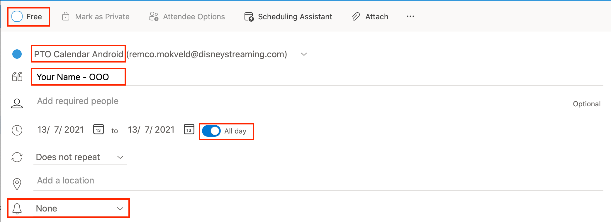
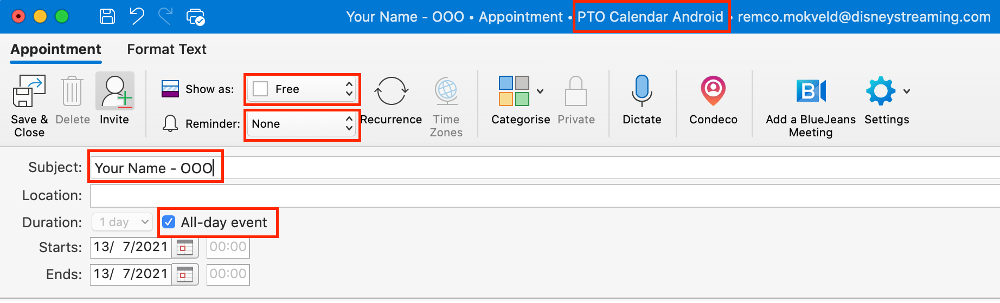
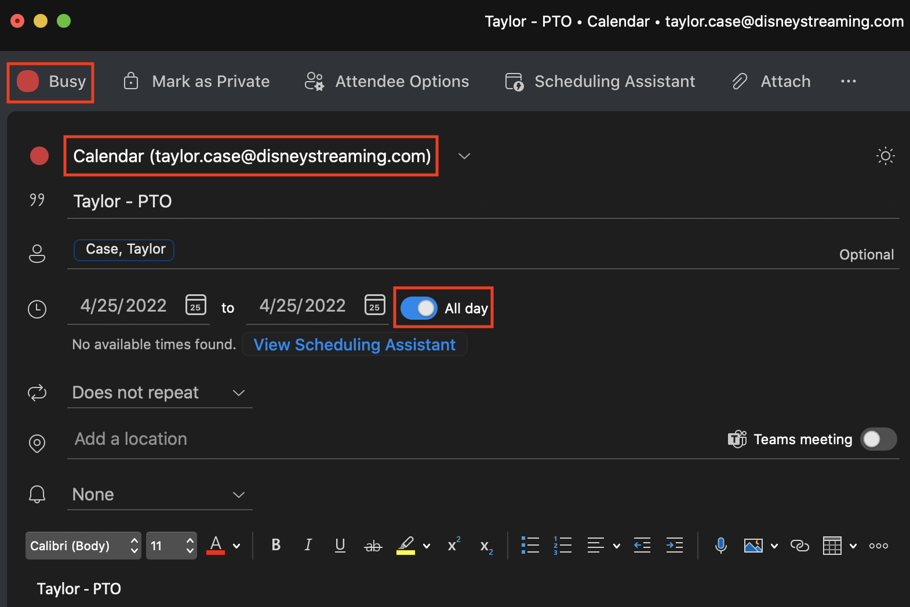

# PTO

- This doc shows how to enter PTO
- Please check our `PTO Calendar Android` to make sure not too many people on your workstream have already requested off

## 1. Add event to `PTO Calendar Android`

- In Outlook, create a new event in the `PTO Calendar Android` calendar. If you don't see this calendar reach out to your TPM to get you added.
- For the event name, enter `Your Name - OOO`
- There is no need to add any invitees to the event.
- If your PTO is only during a few hours of your day, add it as a normal event, if it is at least 1 full day, add it as a full-day event.
- Set `REMINDER` (bell icon) to `NONE`
- Click `SEND`/`SAVE` depending on your Outlook version

Here's an image highlighting the important sections in the new Outlook:

And in the old outlook it looks like this

## 2. Add Event to personal Calendar

- Create an event in Outlook and invite yourself with the title `Your Name - PTO`
- Make sure the status of the event is **Busy**
- This will block off your calendar while you are OOO. This is useful if someone is going to invite you to a meeting, they will see your calendar is blocked off then, and that meeting time does not work

## 3. Enter PTO the official way

- [EU Employees Link](https://www.adp.nl/)
    - Login to ADP [here](https://portaal.hrensalarisgemak.nl/25000007/Employee/LeaveAndSickness/Registration/LeaveRegistration)
    - Navigate to `Registration`, `Verlof`
    - Fill out the form, click `Submit`
    - The request will be routed to your manager for approval (or to Aaron Rietschlin if your manager is in the US)

!!! tip

    You can swap between Dutch and English at the top right

- [US Employees Link](https://disney.service-now.com/hr_external_link.do?sysparm_link=fiori_Enter_My_Time)
    - Click `Create` in the bottom right corner
    - Under `Att./Absence type`, look at the suggestions to decide which to pick. Once you've decided, type in _only the number_. So for **Vacation (0100)**, just type in `0100`
    - Click on the days you want to enter. They should highlight to blue
    - Under `Hours`, enter 8 hours (no matter how many days you selected)
    - Click `Submit`

!!! tip

    Use `Floating Holidays` before `Vacation (0100)` since `Floating Holidays` do not roll over to next year

## 4. Set your Slack status

- Set your Slack status to something like **Vacationing - back on x/x** during the time that you are on PTO so that anyone who wants to reach out will see that you are OOO

## PTO / Company Holiday Links

- View your PTO / Time off
    - [US Employees Link](https://sap.disney.com/sap/bc/ui5_ui5/sap/ZMY_TIMEOFF_2/index.html?sap-client=800&sap-lang=en)
    - [EU Employees Link](https://portaal.hrensalarisgemak.nl/)
- [Company Holidays](https://disney.service-now.com/DToolsHR?id=dthr_search&tags=Holidays)
