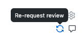

# Pull Requests

This doc will go over our best practices for submitting / maintaining pull requests (PR) on our team

## Creating a Pull Request

### Template

- To make PRs as informative as possible, [a template](https://github.bamtech.co/Android/Dmgz/blob/development/docs/PULL_REQUEST_TEMPLATE.md) has been set up to help you out
- To keep the PR short, **please remove all parts of the template that are not relevant for your PR**

### Point to the correct branch

- Make sure you're pointing to the right branch. More often than not, that will be `development`
- After we cut an RC (`Release Candidate`), you might branch off of that RC branch and point your PR to the RC
    - When working on a `Jira` ticket, the `Fixed Version` in the `Jira` will tell you if you should point your fix to `development`, or an RC
    - If our RC branch / version is `release/1.13`, and the `Fixed Version` in the `Jira` you're working on is `1.13`, then point to `release/1.13` instead of `development`

### Summary

Write a summary, potentially giving context to the fix you're proposing and / or explaining the bug

### PR Title

- PR titles follow the following pattern: `TICKET-EXTENSION-TICKET-NUMBER: SHORT DESCRIPTION`

!!! example

    - [DMGZAND-7627: Fix keyboard network error](https://github.bamtech.co/Android/Dmgz/pull/7910)

### Reviewers

- Add reviewers to your PR
- Make sure to add your sub-team to all of your PRs
- If you are on `Team Edna`, for example, just type `Team Edna` and add them as a reviewer
- You can also add individual, specific developers, or even `Dmgz Leads`

!!! tip

    - When you are reviewing a PR, after you approve or write comments, GitHub forgets that your sub-team was a reviewer on that PR. Make sure to re-add your sub-team as a reviewer after you review a PR
    - When submitting a PR, add the sub-team that normally works on that feature to loop them in (if it isn't your own sub-team). [Here are the sub-teams](https://wiki.disneystreaming.com/pages/viewpage.action?pageId=76454653) and the features they are responsible for to reference

### Labels

- Make use of Labels to indicate what your PR is about
- Labels are also very useful to later find back PR related to a specific topic
- If a label does not exist for the feature you are working on, feel free to create a new one [here](https://github.bamtech.co/Android/Dmgz/labels)
- Common labels to be aware of
    - `WIP` - I'm still working on this PR
    - `do not merge!` - Do not merge this PR
    - `automerge` - This will automatically merge your PR. We will discuss this more later
    - `Don't review` - Do not review this PR
    - `help wanted` - HELP
    - `review-by-commit` - Add this label when you think it would be beneficial for a reviewer to review your PR by each commit

### Testing Notes

- **Please write thorough testing notes**
- When writing thorough testing notes, it helps other developers review your PR that might not be familiar with the feature you and your sub-team are coding
- The easiest way to write thorough testing notes is to assume the person reviewing your PR has zero knowledge of what your code fixes or does

!!! example

    - [PR with thorough testing notes](https://github.bamtech.co/Android/Dmgz/pull/6109)

- Please add before / after screenshots and / or a short GIF
- If another developer cannot test your PR without needing to change some code locally, please provide a patch for them to apply
    - To create a patch in Android Studio:
        - Make the local changes in Android Studio you want to have be in your patch
        - Go to `VCS`, `Create Patch From Local Changes...`
    - To apply someone else's patch in Android Studio:
        - Copy paste the patch code into a file on your desktop with the file type `.patch`
        - In Android Studio click `VCS`, `Apply Patch...`
        - Find and select your `.patch` file on your desktop

!!! tip "Tips"

    - [KAP is an easy tool](https://getkap.co/) you can use to screen capture and export as GIFs for PRs
    - You can use `Logcat`, `Screen Record` inside of `Android Studio`, and then use [KAP](https://getkap.co/) to convert it to a GIF

### Milestones

- Always tag your PR with a milestone
- This will almost always be the next release version of the app (`1.3.0`, for example), unless you're working on a ticket that will be merged into a RC (`Release Candidate`)

## Keep it small

- Nobody likes to review huge PRs
- We aim at keeping the size of a PR below 500 lines of code changed to improve the review process and give the reviewers an opportunity the grasp what the changes entail

!!! tip "Tips"

    - If you are working on a new feature, first put up a PR with the skeleton fragment/viewmodel/presenter/router code that does not actually do anything and then post followup PRs with the actual implementation
    - Utilize interfaces to put up intermediate work without having everything implemented yet
    - If you really can not get a PR smaller than 500 changes, try to make clear separate commits in the PR so that reviewers can review in bite-size chunks. In this case add the `review-by-commit` labelfor PRs

## Reviewing code

Each PR requires two approvals before getting merged

### Tips for reviewing code

- Feel free to ask questions on pull requests

!!! tip "Tips"

    - We attach `.apk` files to PRs. It is faster to download the `.apk` and install that to test a PR. You also won't have to stash your changes and switch branches!
    - [Here is a quick way](https://github.bamtech.co/Android/Dmgz/pulls/review-requested/@me) to see all PRs that you and your sub-team are assigned to review. Bookmark if you want!

- Common items to keep your eye out for when reviewing a PR:
    - **Design**
        - Using a `@color/` instead of a theme color `?themeColorGrey` - we utilize themes for D+ and S+
        - Using `textAppearance=` instead of `style=`
    - **Architecture**
        - Someone forgetting to use `.replay(1)` and `.connectInViewModelScope()` on a `ViewModel` state stream. [See here for details](https://github.bamtech.co/Android/Dmgz/blob/development/docs/UI-ARCHITECTURE.md#constructing-the-state-stream)
            - `.autoDisposable` on streams - [see more here](https://uber.github.io/AutoDispose/). Sometimes we manually dispose of streams, but that is rare. Prefer `.autoDisposable`
    - **Lack of Unit Tests** - although we do not always unit test everything, we want to try and unit test as much as we can. Especially important business logic
    - **Complex Code** - good code is maintainable, readable code. If something seems too complex, point it out and maybe give a suggestion on how to simplify code
    - **Proper Documentation** - either at the top of a class, a corresponding `README.md` in the module, or even a new entry inside of `/Dmgz/docs/`
    - **CJK Friendly Code**
        - such as `marginStart` instead of `marginLeft`
    - **Accessibility Friendly Code**
        - such as `android:importantForAccessibility="no"`
    - **App Agnostic Code**
        - Ideally we should avoid all hardcoding for `Disney+`, `Star+`, or any other future app we may deploy (since the app is now two apps and one code base)

### Addressing feedback

When someone reviewed your pull request and you addressed their feedback you can request for their review again by clicking on the refresh icon next to their name. This will let your pull request show-up in their feed again



## Merging

- Oftentimes other people will merge your PRs, or they will automatically be merged. In general, though, you are in charge of merging your own PRs
- When a PR is ready to be merged, we add the label `automerge`
    - We do not add the `automerge` label unless at least _two_ people have approved of the PR
    - The `automerge` feature automatically merges PRs into their base branch
    - It works like a queue -- it will automatically merge the oldest PR that has the `automerge` label added to it, and then move on to the next oldest PR that has the `automerge` label on it
    - This is all 'triggered' by a PR being merged
    - Because of this 'trigger', there sometimes is a special state we can get into, and it's important to monitor GitHub to make sure your PR is not in this state
    - The state I'm referring to above is where your PR is the oldest PR on GitHub and it needs to be merged. This is problematic because the `automerge` queue will not be triggered until _one_ PR is merged, and so your PR is the oldest, so we need to get that PR merged manually to keep the merging process moving forward
    - If your PR is in this state, please manually click the `Update Branch` button until your PR is up to date and ready to merge. Then manually press the `Merge` button to get your PR merged
    - Please do not click the `Update Branch` button manually unless your PR is in the above listed state. This is because you will be manually "jumping" the CI queue when you press `Update Branch`. No cutting lines :)
    - **TLDR:** When your PR has two approvals, add the `automerge` label to it. If that PR is the _oldest_ PR with the `automerge` label, you need to merge it manually

!!! tip

    - [Here is a quick way](https://github.bamtech.co/Android/Dmgz/pulls?q=is%3Apr+is%3Aopen+label%3Aautomerge) to see all PRs with the `automerge` label. Bookmark if you want!

- If your PR should not be merged for whatever reason, please put the label `do not merge!` on your PR

## Checks

- On CI we run the following code analysis tools on each PR:
    - **Android Lint** - For Android specific static code analysis
    - **Checkstyle** - For style conventions in Java files
    - **Detekt** - For style conventions in Kotlin files
    - **[Danger](https://danger.systems/guides.html)** - is a script that runs on CI to automate PR reviews. It will report issues that have been configured in [PreBuildDangerfile](/PreBuildDangerfile) and [Dangerfile](/Dangerfile)
    - **[Module Dependency Graphs](#generate-module-dependencies-error)**: when a new module -> module dependency is added, the documentation SVGs need to be updated
        - Run `./gradlew generateModuleDependencies` (`./gradlew gMD` also works) to generate new diagrams and include those in your PR
    - **Template compliance** - To avoid placeholders text to pollute the PR. This is a Dangerfile check. When you have removed the placeholder text
    - Comment with `whammy` on the PR to trigger the check again

- We use the kotlin official styleguide for code formatting with the following adjustments:
    - **Wildcard imports**: With the exception of `kotlinx` imports we never allow wildcard imports

- Besides static code analysis we run all tests on every PR, build the APKs and compile all instrumented tests
    - CI will fail whenever any of these checks fail

## Generate Module Dependencies Error

- You may see an error on a pull request you recently submitted that looks like this:

```text
/tmp/android/docs/gradleModules/mobile.puml is out of date.
New dependencies: [':features:ctvActivation depends on :features:analytticsApi'].
Remove dependencies: []
Please run './gradlew generatetModuleDependencies' to update
```

This means the CI detected some module dependency changes on your PR, and our `.puml` files are now out of date. To fix this, do the following:
    - Update your PR with the latest version of `development` (or whatever the base branch is that you're trying to merge your PR into. This is so you do not have to perform these steps multiple times)
    - On the command line, run the following command:

`./gradlew generateModuleDependencies`  (or `./gradlew gMD` for short)

- That command will automatically update the `.puml` files to reflect the module dependency changes you made on your pull request. Commit the changes after running that command, and push the update to your branch. The error will be gone
