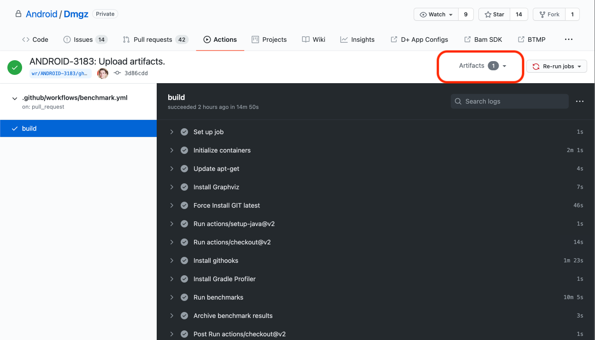

# Benchmarking Build Performances

We use [Gradle Profiler](https://github.com/gradle/gradle-profiler) to benchmark the build performance of Dmgz. There are several scenarios in [/gradle/profiler/](https://github.bamtech.co/Android/Dmgz/tree/development/gradle/profiler) that can be run.

When making changes to [buildLogic](https://github.bamtech.co/Android/Dmgz/tree/development/buildLogic) it is always important to validate that making those changes does not have a negative impact on the overall build performance (unless that negative impact weighs up against the positive impact that the changes make).

## Running locally

You can use the commands in the [makefile](https://github.bamtech.co/Android/Dmgz/blob/development/gradle/profiler/makefile) to run the benchmarks locally.

## Running on GH actions

The most common benchmark, comparing different scenarios on the current branch vs `development`, can be run through GH actions by adding the `benchmark` label to a PR.
After adding the label, a benchmark job is started. When that job is finished, the results of the benchmark are uploaded as artifacts for the job.
You can retrigger a build by removing and readding the label.

