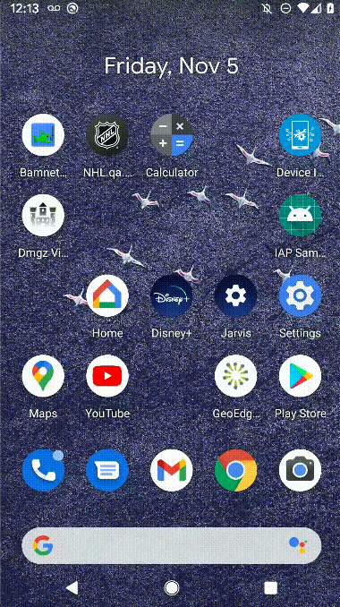
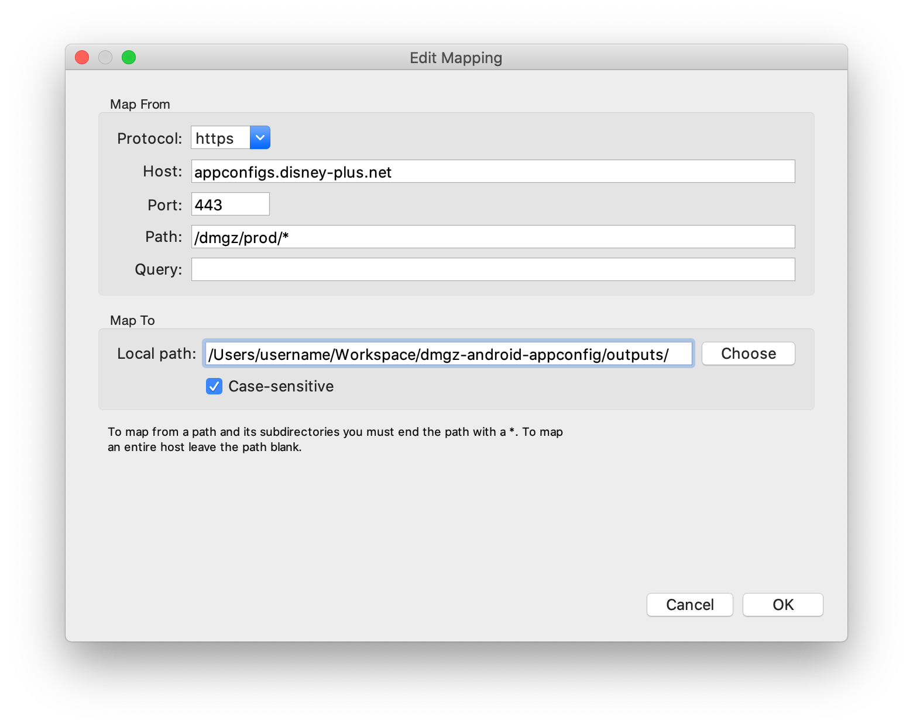
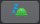

# Charles Proxy

We are using **Charles Proxy** to intercept and debug network requests. This documentation will focus on how to setup and utilize Charles

## Set Up

### 1. Download Charles

- Download Charles from the **Self Service** application pre-installed on your laptop (includes the license for Charles)

!!! warning

    Sometimes **Throttling** is enabled by default after installing. Double check the **[Throttling](#throttling)** section below

### 2. Obtain local IP address

- Make sure your test device / emulator is on the same WiFi network as your laptop
- Copy your local IP address from Charles:
    - Charles toolbar → **Help** → **Local IP Address** → Click on the number and copy it

### 3. Redirect network traffic to Charles

- There are two ways to do this. One way is manually, and the other is with an alias. We _highly_ recommend setting up the alias, as it is much faster once you have it set up

#### Redirect traffic manually

1. **Settings** → **Network & internet** → **WiFi**
2. Click the gear icon for the wifi network you're connected to
3. Click the :octicons-pencil-24: pencil icon to edit
4. Open **Advanced option** dropdown
5. Set **Proxy** to **Manual**
6. Set **Proxy hostname** to your local IP address from [step 2](#2-obtain-local-ip-address)
7. Set **Proxy port** to **8888**



!!! warning

    - When using an emulator, do not set up your Charles with the emulator GUI controls. Do it through the network settings on the actual emulator. Using the GUI controls prevents some SSL proxying
    - If you close Charles on your MacBook the network requests on your device stop working. You'll have to disable the proxy again in the network settings on your device otherwise requests will try to go through Charles but it is closed

#### Redirect traffic with alias

##### Setting up the alias

- Copy the function and alias below and paste it into your shell environment

```bash
function android-proxy-enable() {
  adb shell settings put global http_proxy $1:8888
}

alias android-proxy-disable="adb shell settings put global http_proxy :0"
```

##### Using the alias

- To enable Charles, open the terminal and use our newly added command with your IP address you copied from step 2. Here is an example if your IP address was `192.168.1.15`

```bash
android-proxy-enable 192.168.1.15
```

- To disable charles, open the terminal and use our newly added alias:

```bash
android-proxy-disable
```

### 4. Install Certificate

There are two ways to do this. The first way is for devices / emulators running an older version of Android such as 5 / 5.1

#### a. Install Certificate for older device

- Charles toolbar → **Help** → **SSL Proxying** → **Install Charles Root Certificate on a mobile device** or go directly to **chls.pro/ssl** in the browser on your mobile device
- If you get no feedback from the device that the certificate is installed _or_ on later versions of Android it is not allowed to directly install a certificate from the browser, do the following:
    - Go to the settings of your phone → **Security** → **Encryption & credentials** → **Install a certificate**
    - Choose **CA certificate**
    - Choose the certificate that was downloaded in the background
- If your device doesn't download the certificate:
    - Charles toolbar → **Help** → **SSL Proxying** → **Save Charles Root Certificate...**
    - Save this certificate on your device and use that in the previous step
- This adds the certificates to the list of **Users** certificates that are allowed for debug builds as configured in our [`dplus_network_config.xml`](https://github.bamtech.co/Android/Dmgz/blob/development/utils/networkConfig/src/main/res/xml/dplus_network_config.xml) file

#### b. Install Certificate for newer devices

- Download the `.p12` file [here](https://github.bamtech.co/Android/Dmgz/blob/development/charles-ssl-proxying.p12)
- Charles toolbar → **Proxy** → **SSL Proxying Settings...**
- Go to **Root Certificate**
- Create a secure store if there isn't one with a password of your choosing
- After you created a secure store, click on **Import P12** and select the `.p12` file you downloaded
- To use the `.p12` you need a password. Request this from your team lead
- You should now be able to see the contents of all traffic to BamTech and Disney

### 5. Focused hosts

- You can filter irrelevant network requests by only focusing on requests from relevant hosts
- When opening the **Structure** tab on the top left of Charles, this will show all the relevant requests on top and all other less relevant requests hidden in **Other Hosts**
- To import relevant focused focuses
    - Download our [`Focused Hosts.xml`](https://github.bamtech.co/Android/Dmgz/blob/development/config/charles/Focused%20Hosts.xml) file
    - Charles toolbar → **Tools** → **Import/Export Settings...**
    - Select the downloaded file

!!! info

    More info about Focused Hosts [on the official website here](https://www.charlesproxy.com/documentation/using-charles/focus/)

### 6. Exclude video files

- In most cases, video files are not helpful and they have a big impact on the size of `.chls` files
- To exclude video files in your `.chls` files, do the following
    - Download our [`Exclude.xml`](https://github.bamtech.co/Android/Dmgz/blob/development/config/charles/Exclude.xml) file
    - Charles toolbar → **Tools** → **Import/Export Settings...**
    - Select the downloaded file

## Extra Info

### Map Local

Map local allows you to intercept a network request and change the values that are returned

!!! warning

    Do _not_ forget to remove a Map Local after you're done using it. It is very easy to forget you set one up, and it will mess with your other tasks / testing. More info about [map local here](https://www.charlesproxy.com/documentation/tools/map-local/)

- A perfect example is if an API response is not ready yet, you can:
    - Copy paste the response you want to be returned in a `.json` file on your desktop
    - In Charles, right click the request you want to change. Select **Map Local**
    - Under **Map To**, select **Choose** and select the local `.json` file you saved. Hit **OK**
- Another great example is overriding configs
    - Assuming you have a clone of the [config repo](https://github.bamtech.co/Mobile/dmgz-android-appconfig) in `/Users/username/Workspace/dmgz-android-appconfig`
    - You can set the following Map Local which will replace the path of all requests to `http://appconfigs.disney-plus.net/dmgz/prod/` with whatever is available in `/Users/username/Workspace/dmgz-android-appconfig/outputs`
    - This helps test a config change locally without having / before adjusting them in the repo

 

### Exporting a Map Local

Exporting a map local is a great way to make testing a lot easier for others. To do this, follow these steps:

- Setup your map local in Charles normally (right click a request in Charles → select **Map Local...**, choose local file to map to)
    - It is important that the local file you are mapping to is on your Desktop (tester will have it on their Desktop too later)
- In Charles click **Tools** → **Map Local** → choose your Desktop → select **Export**
- This exports a `.xml` file that another tester can import so that they do not have to find the exact network request in Charles and set it up manually
- Add this `.xml` file and your local mapped file to your PR for the tester
- In your testing notes, inform the tester to put the `.xml` file and the `.json` file on their Desktop
- Next inform your tester to import the `.xml` file you provided in their Charles: **Tools** → **Map Local** → **Import** → select the `.xml` file
- Next inform your tester to double click the Map Local they just imported and to change the value under **Local path** from _your_ user name to _their_ laptop's user name (if you had all files on your Desktop and the tester put all files on their desktop, this is the only value in the **Local Path** that they need to change)
    - **Example:**
        - your **Local path** → `/Users/darth.vader/Desktop/imported_map_local.xml`
        - tester's **Local path** after editing → `/Users/anakin.skywalker/Desktop/imported_map_local.xml`

### Throttling

- You can throttle your network with Charles which can be useful when simulating a user with a poor connection
- You can click the little turtle icon at the top to turn throttling on / off quickly. Throttling is off when the turtle is grey
- You can adjust the strength of the throttling by going to:
    - Charles toolbar → **Proxy** → **Throttle Settings...** → change the **Throttle Preset** value

|       | Enabled |
| :-----------: | :-----------: |
|  | :white_check_mark: Enabled |
|  | :x: Disabled |

!!! warning

    Do _not_ forget to remove throttling after you're done using it. It is very easy to forget you enabled it, and it will mess with your other tasks / testing

### SSL Proxying locations

Instead of having to allowlist every sub-domain for SSL proxying, we will add a few manually. Follow these steps:

- Charles toolbar → **Proxy** → **SSL Proxying Settings** → **SSL Proxying** tab
- Add the following:
    - `*.disney-plus.com`
    - `*.bamgrid.com`
    - `disney.my.sentry.io`
    - `qa-ripcut-delivery.disney-plus.net`
    - `prod-ripcut-delivery.disney-plus.net`
    - `appconfigs.disney-plus.net`
