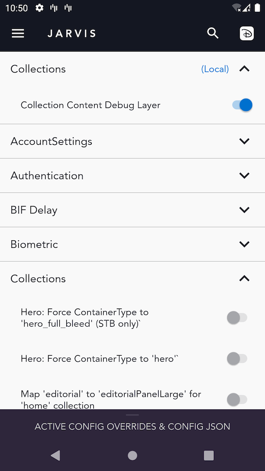
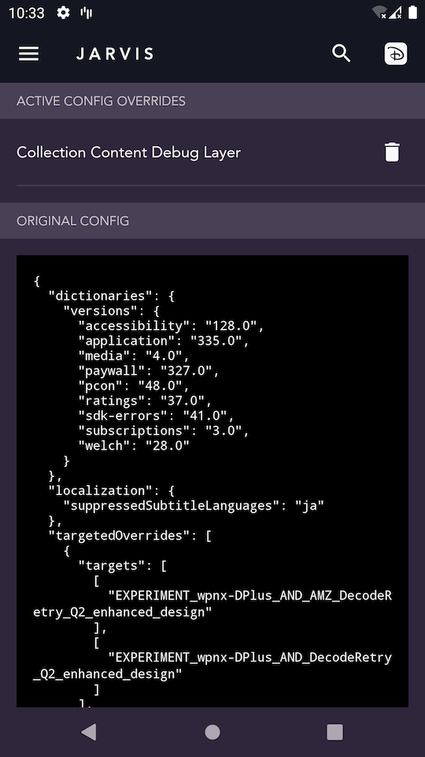

# Jarvis


[Jarvis](https://marvelcinematicuniverse.fandom.com/wiki/J.A.R.V.I.S.) is a standalone app that lives inside of the [**Dmgz** codebase](https://github.bamtech.co/Android/Dmgz/tree/development/apps/jarvis). It allows us to easily override config values, switch environments, time travel, and more!

## Install Jarvis

- There are several ways to install **Jarvis**
    - You can download the latest version of [Jarvis here](https://install.appcenter.ms/orgs/BAMTECH-Media-Organization/apps/Disney-Jarvis-1)
    - In Android Studio Select `apps.Jarvis` from the configurations at the top right and press the green run button
    - Build Jarvis from the command line with `./gradlew :apps:jarvis:installDevDebug` within **Dmgz**

## Features

### Config Overrides

- We can override remote config values by turning on a config toggle in Jarvis
- If Jarvis is installed on a device, when Disney+ starts, it will fetch the configs _through_ Jarvis. Jarvis pulls down the remote config, applies required transformations, and then provides the config to the app
    - The list of transforms / toggles shown in Jarvis are pulled [and can be viewed from here](https://github.bamtech.co/Mobile/dmgz-android-appconfig/blob/qa/outputs/transformations/all.json)
- We can add a config transformation to Jarvis _locally_, or add a new _remote_ config transformation (for all Jarvis users to utilize). It is common to add a config locally, test it, then add it remotely when needed

#### Adding a local config transformation

- Create a file in the root folder of the **Dmgz** project called `local_config_transforms.json`. This file is `.gitignore`ed
- Add the transformation in `.json` format to your `local_config_transforms.json` file. Here is an example for our Collection Content Debug Layer config flag:

```json
    [
       {
         "name": "Collections",
         "transforms": [
           {
             "name": "Collection Content Debug Layer",
             "uniqueKey": "enableContentDebugLayer",
             "transformMap": {
               "collections": {
                 "enableContentDebugLayer": true
               }
             }
           }
         ]
       }
     ]
```

??? Note

    - The boolean config value we added above, `"enableContentDebugLayer": true`, means that if we flip on this config toggle in Jarvis, that value will _now_ be `true`. That means the default value in app is `false`
    - In this `.json` we are declaring a transformation of `Boolean` type set within the collections config group. You can follow this structure to add your own values
    - `uniqueKey` - if two toggles have the same `uniqueKey`, only one of them can remain active at a time. Enabling one would then automatically disable any other toggles with the same key. Similar to a _radio group_ as opposed to a _checkbox group_
    - By putting our transformation within the `transforms` array under the item named "Collections", we are merely indicating that our transformation should be included under the "Collections" section *in the app*.
    This is different than the `collections` object within `transformMap` which declares the full path to the config item as it is accessed within the app (in this case, `collections.enableContentDebugLayer`)   

- Run a `make` command depending on which app you are using to broadcast your new local config transformation to Jarvis:
    - `make install_local_transforms_groups_disney` - for Disney+
    - `make install_local_transforms_groups_star` - for Star+

- Verify it worked by opening Jarvis and looking for the word **(Local)** in blue



- Turn on your newly added local config in Jarvis
- Swipe up in Jarvis view the **ACTIVE CONFIG OVERRIDES & CONFIG JSON**



- Now that you confirmed your local config is active in Jarvis, you are ready to restart the Disney+ / Star+ app to reload the config. To be safe, clear app data. Read more about config caching in `ConfigLoaderImpl.kt`

!!! Tip
    If you run the command `make print_local_active_config_transforms` it will print out an `adb` command you can copy and paste in a Pull Request for other developers to use to test your local transformation you just setup. This is useful because you may not have set up the transformation remotely yet

#### Deleting a local config transformation

- Both of these will delete the `.json` file from the connected device
    - `make remove_local_collection_config` - uninstall the collection config
    - `make remove_local_app_config` - uninstall the app config

#### Adding a Jarvis Config Transformation

- Clone our app config repo [`dmgz-android-appconfig`](https://github.bamtech.co/Mobile/dmgz-android-appconfig)
- Checkout the `qa` branch. Create a new branch off of the `qa` branch
- Add your `.json` config values from step one to `/outputs/transformations/all.json`, preferably in alphabetical order by section name
- Commit your change, push up, and create a Pull Request
    - [Here is the Pull Request from our example](https://github.bamtech.co/Mobile/dmgz-android-appconfig/pull/698)
- Once merged, you're done!

#### Consuming a remote config transformation in Dmgz

- We now need to create this transformation in the correct class within **Dmgz** so that we can check this config value in the code
- Using our **Collection Content Debug Layer** config example from step 1, we can add the required code to the corresponding config class inside of **Dmgz**: `CollectionsAppConfigImpl.kt`

```kotlin
   @get:ConfigDoc(
        path = "collections.enableContentDebugLayer",
        description = """
            Enables a debug layer that displays useful info about the content being presented in the shelves
        """
    )
    override val enableContentDebugLayer: Boolean
        get() = map.value("collections", "enableContentDebugLayer") ?: false
```

- Our `path` value is `collections.enableContentDebugLayer`. That is because in step 1, we declared the `transformMap` to include `"collections"` and then `"enableContentDebugLayer"`
- You can see how the `get()` method attempts to get a remote config value (or a **Jarvis** value if it is installed on your test device). If that value is not there, we default to `false`
- [Here is the Pull Request for our example](https://github.bamtech.co/Android/Dmgz/pull/9158)

### Delorean

- Inside of Jarvis, you can select **Delorean** to _travel_ to a certain time or place
- This is particularly useful for testing specific scenarios that are not yet released

### Environment Switcher

- Inside of Jarvis you can select **ENVIRONMENT SWITCHER** to change app environments
- Select the environment you want, scroll down, then select **SWITCH ENVIRONMENT**

#### Vision Config Source

- Under the **Environment Switcher**, you can also adjust **Vision Config** settings
- Vision allows us to host specific content that can be consumed by the app
    - [Using Project Vision on Android](https://github.bamtech.co/pages/fed-solutions/project-vision-docs/source/visionware/android.html#android)
    - [Project Vision Documentation](https://github.bamtech.co/pages/fed-solutions/project-vision-docs/)
    - [Project Vision home page](https://project-vision.disneystreaming.com/)

### Bundled Jarvis Variant

- The bundled Jarvis variant has no UI and is used to bundle a config at compile time for Disney+
- This is used for 3rd party testers to test the app with a specific config
- This variant bundles a config at compile time. It does not provide any UI and is primarily meant to let 3rd party testers test the app with a specific config
- As a developer you can define what config would be loaded when the `.apk` is installed and that config will then always be loaded instead of the remote config until the app is removed
- To bundle a config you need to add `${configId}.json` in the `/src/bundled/assets/` directory
    - For Disney+ right now that would be either `dplus-app.json` or `dplus-collections.json`, so:
        - `/src/bundled/assets/dplus-app.json`
        - `/src/bundled/assets/dplus-collections.json`
        - These files have both been git ignored to make it easy to make changes locally
