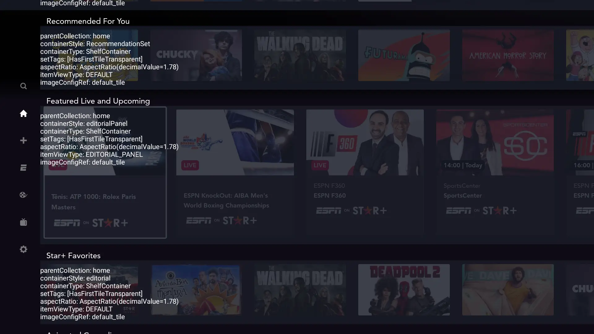
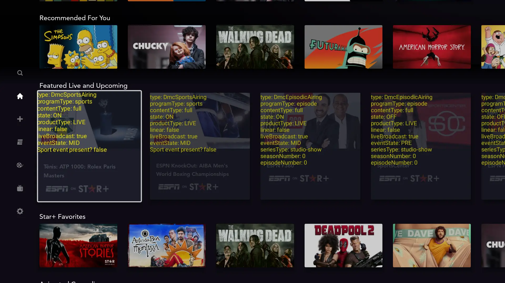

# Debug Mode

There are 2 debug layers implemented that allow developers (or even QA team) to see any additional debug information on asset or container level. The debug overlays could be enabled via Jarvis.

!!! tip "Enable Container Debug Layer"
    On Jarvis, toggle `Collections → Enable Container Debug Layer` for enabling the debug overlay on container level.

???+ example "Container Debug Layer Enabled"
    

!!! tip "Enable Content Debug Layer"
    On Jarvis, toggle `Collections → Collection Content Debug Layer` for the debug layer on asset level (Note: this is currently implemented for the EditorialPanelItem only).

???+ example "Content Debug Layer Enabled"
    

***
